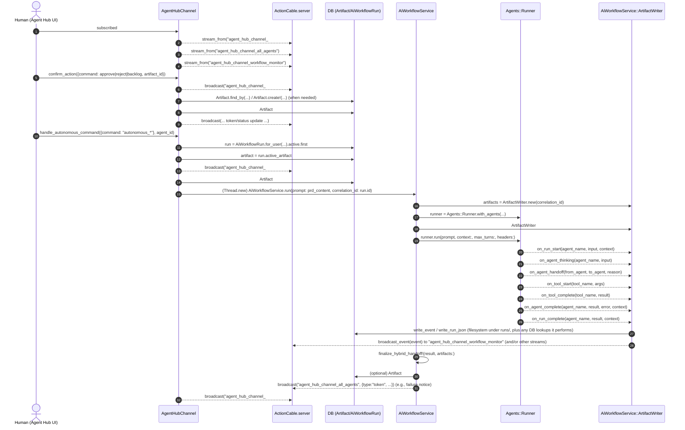

### Handoff graph (LLM multi-agent routing) — `AiWorkflowService.run`

```mermaid
graph TD
  %% Entry
  Run[AiWorkflowService.run(prompt:, correlation_id:, max_turns:)] --> Runner[Agents::Runner.with_agents(...)]

  %% Agent construction
  Run --> BuildSAP[AiWorkflowService.build_agent(name: "SAP", ...)]
  Run --> BuildCoord[AiWorkflowService.build_agent(name: "Coordinator", ...)]
  Run --> BuildPlanner[AiWorkflowService.build_agent(name: "Planner", tools: [TaskBreakdownTool])] 
  Run --> FetchCWA[Agents::Registry.fetch(:cwa, ...)]

  %% Runner executes the turn loop
  Runner -->|runner.run(prompt, context:, max_turns:, headers:)| TurnLoop[(Turn loop / max_turns)]

  %% Handoff edges (explicitly configured via handoff_agents)
  BuildSAP --> SAP[SAP agent]
  BuildCoord --> COORD[Coordinator agent]
  BuildPlanner --> PLAN[Planner agent]
  FetchCWA --> CWA[CWA agent]

  SAP -->|handoff_agents: [Coordinator]| COORD
  COORD -->|handoff_agents: [Planner, CWA]| PLAN
  COORD -->|handoff_agents: [Planner, CWA]| CWA
  PLAN -->|handoff_agents: [CWA]| CWA

  %% Tool use (Planner)
  PLAN -->|tools: [TaskBreakdownTool]| Tool[TaskBreakdownTool]

  %% End-of-run finalization
  TurnLoop --> Result[result]
  Result --> Finalize[AiWorkflowService.finalize_hybrid_handoff!(result, artifacts:)]
  Finalize --> ArtifactPhase[Artifact#transition_to(action, actor_persona)]
```

#### Notes tied to concrete code
- Agent graph is built in `AiWorkflowService.run` (see calls to `build_agent(...)` and `Agents::Registry.fetch(:cwa, ...)`).
- “SAP must route” is enforced by SAP’s instructions: `"You are a routing agent... MUST call handoff_to_coordinator"`.
- Turn budget is passed into `runner.run(..., max_turns: max_turns, ...)`.

---

### Event + broadcast flow (UI + monitoring + run artifacts)

This diagram shows the *event plane* (ActionCable broadcasts) plus the *run artifact logging plane* (callbacks in `AiWorkflowService::ArtifactWriter`).



#### Concrete broadcast channels involved
- Persona stream: `"agent_hub_channel_#{params[:agent_id]}"` (set in `AgentHubChannel#subscribed`).
- Global stream: `"agent_hub_channel_all_agents"` (used for sidebar/global status; also used in `AiWorkflowService` failure broadcast).
- Monitor stream: `"agent_hub_channel_workflow_monitor"` (subscribed in `AgentHubChannel#subscribed`; events emitted via `AiWorkflowService::ArtifactWriter#broadcast_event`).

---

### If you want the diagram to be *strictly complete*

To fully ground “turn” semantics and exactly which events are broadcast to which stream, the remaining source of truth is the `Agents::Runner` and `Agents::Registry` implementation (where “turn” is incremented and where callbacks fire). If you tell me where those live (likely under `app/services/agents` or `lib/agents`), I can extend the diagrams to include those concrete methods too.